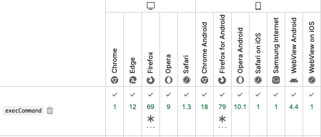

# 2025年7月24日

## JavaScriptでのコピー機能の違い

- `document.execCommand("copy")`
  - 古いAPI。テキスト選択状態で実行するとクリップボードにコピーできる。
  - 非推奨、古いブラウザでもコピー可能。
  - 対応状況  
    


- `window.clipboardData`
  - 主にIEで使われていた。
  - 他のブラウザでは利用不可。

- `navigator.clipboard.writeText`
  - 新しい標準API。非同期でクリップボードにテキストを書き込める。
  - HTTPS環境でのみ利用可能。現在はほとんどのモダンブラウザでサポート。
  - 対応状況  
    

### 参考  
  [Document: execCommand() メソッド](https://developer.mozilla.org/ja/docs/Web/API/Document/execCommand)

  [Clipboard: writeText() method](https://developer.mozilla.org/en-US/docs/Web/API/Clipboard/writeText)

<br>


## 今日の疑問

### 前者だと ***X-CSRF-Token*** を指定する必要がないのはなぜ？

```javascript
const data = await $.ajax({
  type: 'POST',
  url: "#{site_external_service_api_keys_path(@site.name)}",
  dataType: 'json'
});
```

```javascript
const response = await fetch(
  "#{site_external_service_api_keys_path(@site.name)}",
  {
    method: 'POST',
    headers: {
      'X-CSRF-Token': $('meta[name="csrf-token"]').attr('content'),
      'Accept': 'application/json'
    }
  }
);
```

### 理由

- **jQueryの`$.ajax`**  
  rails-ujsが自動的にCSRFトークンがヘッダーに付与しているため。
  https://github.com/rails/rails/blob/main/actionview/app/assets/javascripts/rails-ujs.js
  のソースコードにもぽい奴が書いてる

- **fetch API**  
  fetchの場合は自動でCSRFトークンが付与されないため、手動で`headers`に`X-CSRF-Token`を追加する必要がある。
