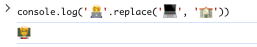

# 2025年8月12日

## リファクタリング
### 目的
- コードの可読性を向上させる
- 重複したコードを削減する
- モジュール性を高める
- 保守性を向上させる
- パフォーマンスを改善する

<br>

## JavaScriptでの文字数カウント

### length

🍎などの絵文字や、𩸽といった漢字は2文字とカウントされる場合がある。

### スプレッド構文

文字列を以下のように、文字ごとに区切った配列を得ることができる

```js
console.log([..."abc"]);
//=> [ 'a', 'b', 'c' ]
```

これだと🍎や𩸽は1文字となるが、👨🏻‍💻といった絵文字は以下のようになる

```js
console.log([..."👨🏻‍💻"]);
//=> [ '👨', '🏻', '‍', '💻' ]
```

### Intl.Segmenter

Node.jsや主要な最新ブラウザにて実装されている。
古いブラウザでは実装されていなかったが、最近はほとんどのブラウザで使用できそう？

文字、インデックス、全文からなる配列を返す

これだと、絵文字なども正確にUIでの文字数を取得できる

```js
const segmenter = new Intl.Segmenter("ja", { granularity: "grapheme" });
console.log([...segmenter.segment("あいうえお")]);
```

こんな感じでユーティリティ関数にすると良いらしい

```js
function countGrapheme(string) {
  const segmenter = new Intl.Segmenter("ja", { granularity: "grapheme" });
  return [...segmenter.segment(string)].length;
}
```

### おまけ

絵文字を以下のようにして変更したりできるらしい

'👨🏻‍💻'.replace('💻', '🏫'), // 👨🏻‍🏫 
'👨🏻‍🏫'.replace('🏫', '🎓'), // 👨🏻‍🎓


### 実際試した画像



### 参考
- https://qiita.com/suin/items/3da4fb016728c024eaca
- https://qiita.com/suin/items/c4a3c551a76042c75c3d

<br>

## railsのエラーの取り出し方
