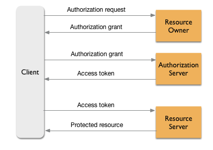

# 2025 年 10 月 16 日

## OAuth 2.0

- アクセストークンの要求方法とそれに対する応答方法を標準化したもの
- ユーザー名やパスワードなどの実際のユーザー資格情報を共有することなく、あるサービスから別のサービスへ権限を与えるためのプロトコル

### フローの図

### 登場人物

#### アプリ(Client)

- ユーザーに保護されたリソースへのアクセスを求める
- 認可サーバーにアクセストークンを要求
- リソースサーバーに、アクセストークンと共にリクエストを送る

#### エンドユーザー(Resource Owner)

- アプリに、自身のリソースの仕様を許可する

#### 認可サーバー(Authorization Server)

- アクセストークンを発行する

#### リソースサーバー(Resource Server)

- アクセストークンを検証
- ユーザーのリソースを使用した API リクエストを処理する

### 参考

- https://qiita.com/TakahikoKawasaki/items/e37caf50776e00e733be
- https://www.cloudflare.com/ja-jp/learning/access-management/what-is-oauth/
- https://cloud.google.com/apigee/docs/api-platform/security/oauth/oauth-introduction?hl=ja
