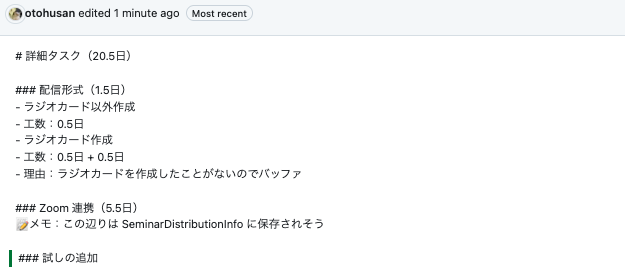

# 2025年10月28日

## YARD コメント
- Rubyのソースコード内に記述する特別なコメント
- YARDというドキュメント生成ツールが、それらを読み取ってAPIドキュメントを自動作成する

### 参考
- https://qiita.com/mtnkbp/items/f8c28f475747eea69dcf

## Rails CRUD系メソッド 戻り値の勉強に良いサイト
- https://qiita.com/murakami-mm/items/3e12c4d2fcabd4b1b95b
- 以下のようなのをまとめてくれてる

### save
- データベースへの保存に成功した場合は true 、失敗した場合は false が戻り値

### save!
- データベースへの保存に成功した場合は true が戻り値、バリデーションに失敗した場合は例外

## GitHub の issue で編集履歴見れることを知った
以下の画像みたいに差分を簡単に見つけられる

