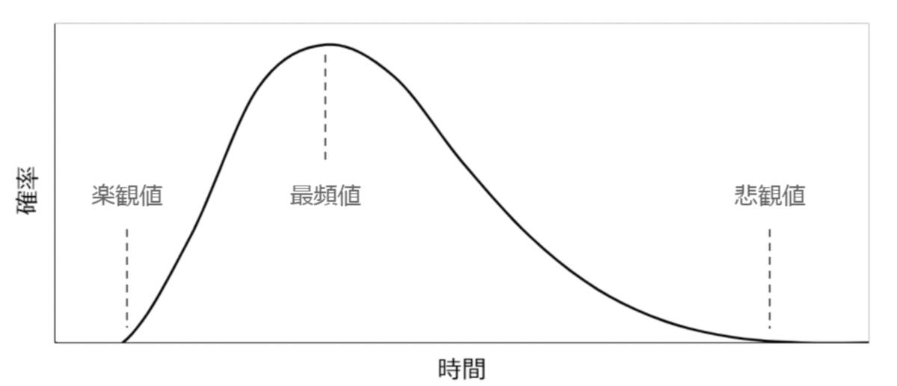

# 2025年8月5日

## 工数見積もりに関して
- Qiita
    - 工数の乖離が起きるのは粒度が大きすぎるのかも
    - 1つのタスクが3時間以下になるまで細分化する？
    - そのタスクの集合として、のべ何日かかるみたいな感じ

- Baseconnect Tech blog
    - 早くしなきゃと遅れちゃいけないの心理的ストレッチがあるらしい
    - 下記はブレ幅の特徴を表した画像
    - 左右対象ではなく後ろに尾をひく形になってる（開発期間の短縮には限界があるが、開発を遅らせる問題には制限がないため）
    - 左右非対称なので、最頻値よりも少し後ろが50%の確率でここまでに開発が終わるという場所になる

    

    - 過去に行なったタスクから、相対的に見積もって、実際の工数を出したりとかもありらしい
    - 理想時間と現実時間という考え方

## 参考
- https://qiita.com/taku-0728/items/7a2f0919ce375bbb48f7
- https://techblog.baseconnect.in/entry/2022/08/23/184330
