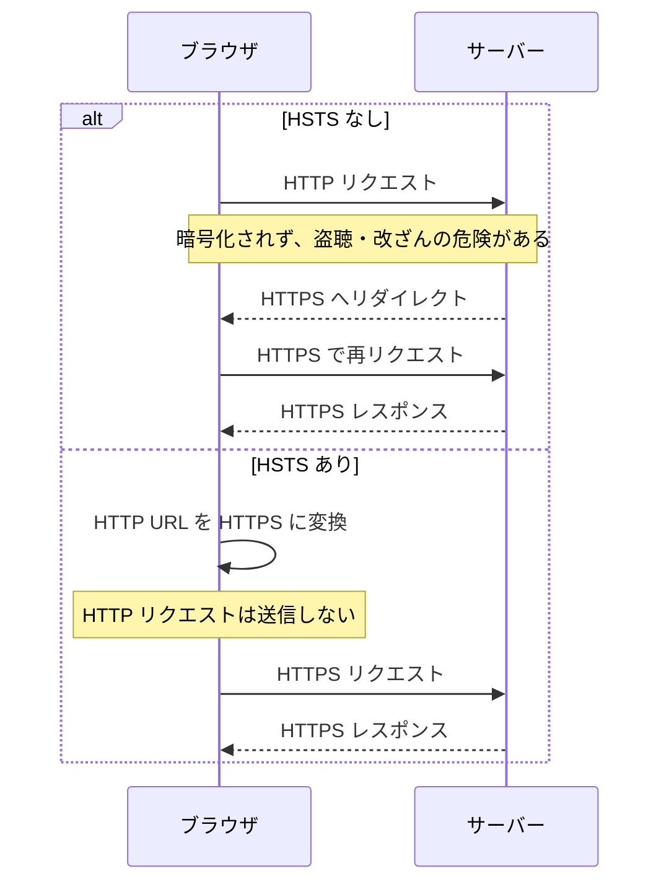

## 10月2日

### Strict-Transport-Security ヘッダー（HSTS）

ブラウザに「このサイトには今後 HTTPS でのみ接続する」ことを記憶させるレスポンスヘッダー。
HTTP でアクセスしても HTTPS にブラウザ側で自動変換され、接続されるようになる。

```http
Strict-Transport-Security: max-age=31536000; includeSubDomains
```



HSTS がない場合、HTTPS へリダイレクトされる前の HTTP リクエストは暗号化されないため、この通信を攻撃者に盗聴・改ざんされる可能性がある。

- `max-age`: HTTPS のみを使用する期間（秒）
- `includeSubDomains`: すべてのサブドメインにも適用する
- `preload`: 初回アクセス前から HSTS を有効にするための事前登録用（非標準）

参考: [MDN - Strict-Transport-Security ヘッダー](https://developer.mozilla.org/ja/docs/Web/HTTP/Reference/Headers/Strict-Transport-Security)
