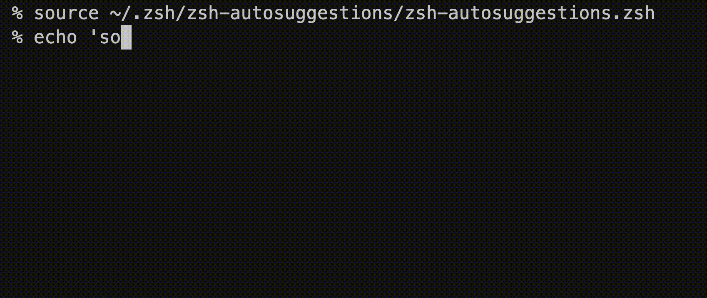

# 2026 年 1 月

## 1 月 6 日

## pluck とは

指定したカラムのレコードを配列として取得する

```ruby
# 単一カラムの取得
User.pluck(:name)
# => ["田中", "山田", "佐藤"]

# 複数カラムの取得
User.pluck(:id, :name)
# => [[1, "田中"], [2, "山田"], [3, "佐藤"]]

# 条件付きで取得
User.where(active: true).pluck(:email)
# => ["tanaka@example.com", "yamada@example.com"]
```

## pluck と map の比較

### pluck

必要なカラムのみを SQL で取得をする

```zsh
SELECT `users`.`id` FROM `games`
```

### map

全てのカラムを SQL で取得する

```zsh
SELECT `users`.* FROM `games`
```

### まとめ

メモリの使用量の面では pluck が断然有利になる。

注意点としては、pluck は毎回 SQL を発行するらしいため、繰り返しの中で使用してしまうと問題になる

### 参考

- <https://qiita.com/TT-nasu/items/e6971efd1383d7f500dd>
- <https://railsdoc.com/page/model_pluck>

### 余談

id のみを pluck したい場合は ids みたいなものがありそう

## 1 月 10 日

### zsh コマンド入力を楽に

#### zsh-autosuggestions

過去のコマンドの実行履歴から推測して、コマンドを表示してくれる



#### zsh-autocomplete

入力に応じて自動的に、実行可能なコマンドが表示される


#### 参考

- https://github.com/marlonrichert/zsh-autocomplete
- https://zenn.dev/yutakatay/articles/zsh-autocomplete-intro
- https://github.com/zsh-users/zsh-autosuggestions?tab=readme-ov-file
