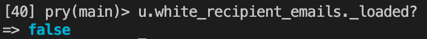
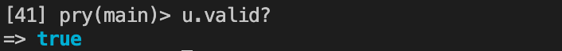
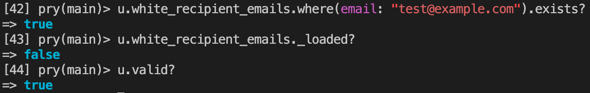
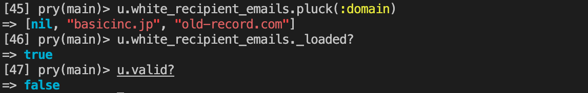

# 2026 年 2 月

## 2 月 2 日

### ruby uniq

配列から重複した要素を取り除いた新しい配列を返す

```ruby
p [1, 3, 2, 2, 3].uniq   # => [1, 3, 2]
```

ブロックを渡した場合は、ブロックが返した値が重複したものを削除

```ruby
p [1, 3, 2, "2", "3"].uniq { |n| n.to_s } # => [1, 3, 2]
```

要素を先頭から辿っていき、最初に出現したものが残る

#### 参考

- https://docs.ruby-lang.org/ja/latest/method/Array/i/uniq.html

## 2 月 3 日

### ruby ブロック内での変数定義

通常、未定義の変数に参照しようとした場合は `NameError` が発生する

ただ、ブロック内にて定義され、そのブロックが実行されない場合は `nil` が返る

```ruby
# ブロックが実行される場合
if true
  x = 123
end
puts "x = #{x.inspect}" # => X = 123

# ブロックが実行されない場合
if false
  y = 456
end
puts "y = #{y.inspect}" # => y = nil
```

## 2 月 5 日

### ruby transform_values

ハッシュの value に対して処理を行うことができる

```ruby
prices = { apple: 100, banana: 150, orange: 200 }

# 全ての値を1.1倍に
result = prices.transform_values { |v| (v * 1.1).round }
p result
# => {:apple=>110, :banana=>165, :orange=>220}
```

- 元のハッシュは変更されない（非破壊的メソッド）
- 破壊的版の transform_values! も存在する

#### 参考

- https://docs.ruby-lang.org/ja/latest/method/Hash/i/transform_values.html

## 2 月 10 日

### Time.current と Time.now

#### Time.current

config/application.rb に設定してあるタイムゾーンを元に現在日時を取得している、Rails 独自のメソッド

#### Time.now

環境変数(ENV['TZ'])、もしくはシステムのタイムゾーンを元に現在日時を取得している

## 2 月 12 日

### REST API レスポンスにデータがない場合

JSON は RFC に以下のように定義されてる。

基本的には null で表現するのが良さそう

```md
A JSON value MUST be an object, array, number, or string, or one of the following three literal names

      false
      null
      true
```

ただ、Google JSON Style Guide には、以下のように`空やnullの場合はプロパティごと削除すべき`みたいな感じで書いていて難しい

```
Consider removing empty or null values. If a property is optional or has an empty or null value, consider dropping the property from the JSON, unless there's a strong semantic reason for its existence.
```

### 参考

- https://zenn.dev/kirimaru/articles/cb631b1b848e86
- https://www.rfc-editor.org/rfc/rfc8259
- https://google.github.io/styleguide/jsoncstyleguide.xml#Empty/Null_Property_Values

## 2月 25日
### mongoid valid? について
- 親によって valid? を実行する場合は関連にある子のバリデーションもチェックする 
  - ただ、親のメモリにロードされている範囲内にてチェックが行われるぽい [doc](https://www.mongodb.com/ja-jp/docs/mongoid/current/data-modeling/validation/#:~:text=%E6%B0%B8%E7%B6%9A%E5%8C%96%E3%83%87%E3%83%BC%E3%82%BF%E3%81%A7%20valid%3F%E3%82%92%E5%AE%9F%E8%A1%8C%E4%B8%AD%E5%A0%B4%E5%90%88%E3%80%81Mongoid%20%E3%81%AF%20ActiveRecord%20%E3%81%A8%E3%81%AF%E5%8B%95%E4%BD%9C%E3%81%8C%E7%95%B0%E3%81%AA%E3%82%8A%E3%81%BE%E3%81%99%E3%80%82%20ActiveRecord%20%E3%81%AE%20valid%3F%20%E3%81%AF%E3%81%99%E3%81%B9%E3%81%A6%E3%81%AE%E6%A4%9C%E8%A8%BC%E3%82%92%E5%AE%9F%E8%A1%8C%E3%81%97%E3%81%BE%E3%81%99%E3%81%8C%E3%80%81Mongoid%20%E3%81%AE%20valid%3F%20%E3%81%AF%E3%83%91%E3%83%95%E3%82%A9%E3%83%BC%E3%83%9E%E3%83%B3%E3%82%B9%E3%82%92%E6%9C%80%E9%81%A9%E5%8C%96%E3%81%99%E3%82%8B%E3%81%9F%E3%82%81%E3%81%AB%E3%83%A1%E3%83%A2%E3%83%AA%E3%81%AB%E3%81%82%E3%82%8B%E3%83%89%E3%82%AD%E3%83%A5%E3%83%A1%E3%83%B3%E3%83%88%E3%81%AB%E5%AF%BE%E3%81%97%E3%81%A6%E3%81%AE%E3%81%BF%E6%A4%9C%E8%A8%BC%E3%82%92%E5%AE%9F%E8%A1%8C%E3%81%97%E3%81%BE%E3%81%99%E3%80%82)

なので、特定の処理によってメモリにロードするかしないかが変わり、予期せぬバリデーションエラーに出くわすことがある

#### 例
##### 前提
- user は white_recipient_emails を 1対多 の関係で持ち、white_recipient_emails には不正な値が紛れ込んでいる

##### 初期状態
- 親は関連にある子の情報をメモリに読み込んでいない
- 親の状態も正常




##### where が実行される場合
- 親は子の情報をメモリに読み込まない
- 親の情報は正常なまま



##### pluck が実行される場合
- pluck を実行すると親が子の情報を取得する
- 子の値が不正なため 親の `valid?` が不正になる



##### まとめ
- valid は 親が読み込んでいる子の範囲内にてバリデーションチェックを実行する
- where, pluck などメモリに読み込む、読み込まない処理が存在するので、その処理が実行されたかしないかでチェックの内容が変わる場合が存在する