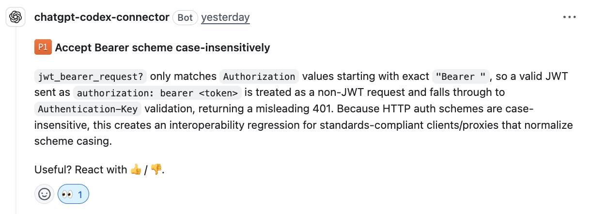
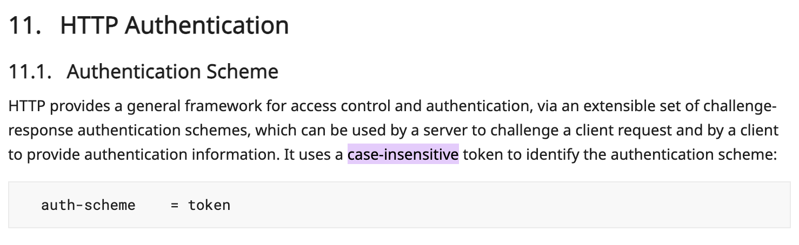
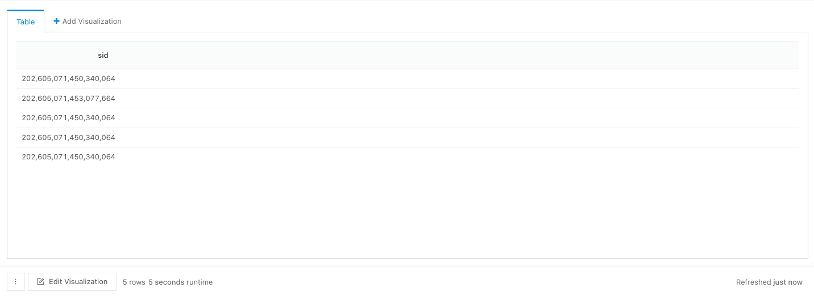
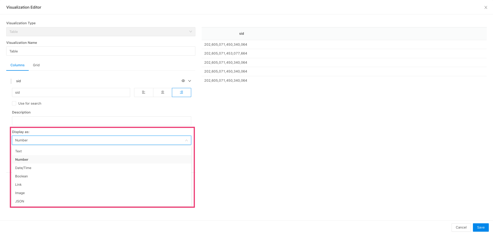
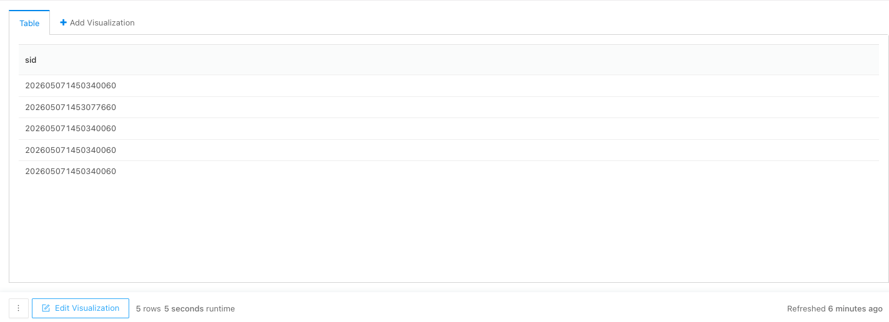

## 5月 1日

### http 認証スキーマについて

http リクエストヘッダーに付ける、`authorization: Bearer <token>` のようなやつ  
Basic認証, Bearer認証, Digest認証 あたりがよく耳にする？

（詳しくは [MDN](https://developer.mozilla.org/ja/docs/Web/HTTP/Guides/Authentication#%E8%AA%8D%E8%A8%BC%E6%96%B9%E5%BC%8F) ）

ここから本題なんですけど

ある実装をした時に、以下みたいな codex のコメントがつきました  


`authorization: Bearer <token>`  の `Bearer` の部分は大文字小文字を区別してはいけないよってことらしい  
（case-insensitive で大文字小文字を区別しないって意味なんですね、知りませんでした）

ほんとかなと思って、RFC を調べると、`case-insensitive` と書かれていました


https://www.rfc-editor.org/rfc/rfc9110.html#name-authentication-scheme:~:text=It%20uses%20a-,case%2Dinsensitive,-token%20to%20identify

AI はすごいなって感じながら、大文字小文字を区別しないように修正しました

## 5月 8日

### 署名アルゴリズム

JWT などで使われる、トークンの改ざん検知・送信者の検証を行うためのアルゴリズム。  
トークンに対して署名を生成し、受信側がその署名を検証することで、データが改ざんされていないことを確認できる。

### 有名な署名アルゴリズム

#### HS256

対称鍵（共通鍵）方式を使う。

- 署名と検証に **同じ秘密鍵** を使う
- 鍵を共有する必要があるため、署名者と検証者が同一サービスの場合に向いている
- 鍵が漏れると誰でも署名・検証できてしまうリスクがある

#### RS256

非対称鍵（公開鍵暗号）方式を使う。

- **秘密鍵** で署名し、**公開鍵** で検証する
- 署名できるのは秘密鍵を持つ側だけなので、「誰が署名したか」を証明できる
- 公開鍵は自由に配布できるため、複数のサービスが独立して検証できる


| | RS256 | HS256 |
|---|---|---|
| 方式 | 非対称鍵（公開鍵 + 秘密鍵） | 対称鍵（共通鍵） |
| 署名 | 秘密鍵 | 共通鍵 |
| 検証 | 公開鍵 | 共通鍵（署名と同じ鍵） |
| ユースケース | 外部サービス間の検証 | 単一サービス内での検証 |

### 参考
- https://auth0.com/docs/ja-jp/get-started/applications/signing-algorithms

## 5 月 14 日
### redash の数字の表示に関して
redash にて sid や uid などの数字の羅列があると以下のように `,` が数字の間に入る


コピペする時などに邪魔だなって感じる時がある

どうやら左下にある **Edit Visualization** ボタンから表示を切り替えられるらしい 


デフォルトだと以下のように **Number** になってるので **Text** に変更



カンマがない形で表示されるようになる



## redash ハッシュの一部を取得

mongoの場合 以下のように `$user_info.~~` といった記述が必要

```
{
    "collection": "users",
    "aggregate": [
        {
            "$project": {
                "_id": 1,
                "age": "$user_info.age"
            }
        }
    ]
}
```

## 5月25日

### Promise.race について

複数の Promise （非同期処理） を受け取り、**最初に settled（fulfilled or rejected）になったもの**の結果を返す。

```js
const result = await Promise.race([
  fetch("/api/data"),
  new Promise((_, reject) =>
    setTimeout(() => reject(new Error("timeout")), 5000),
  ),
]);
```

上の例では、API レスポンスが 5 秒以内に返ればその結果を、超えたらタイムアウトエラーを得る。

#### 特徴

- 最初に解決 **または** 拒否された Promise の結果がそのまま返る

#### 似たメソッドとの比較

| メソッド       | 返すタイミング                                                         |
| -------------- | ---------------------------------------------------------------------- |
| `Promise.race` | 最初に settled（成功 or 失敗）になったもの                             |
| `Promise.any`  | 最初に **fulfilled** になったもの（全部 rejected なら AggregateError） |

#### よくあるユースケース

- タイムアウト処理（上記の例）

#### 参考

- https://developer.mozilla.org/ja/docs/Web/JavaScript/Reference/Global_Objects/Promise/race
- https://developer.mozilla.org/ja/docs/Web/JavaScript/Reference/Global_Objects/Promise/any
