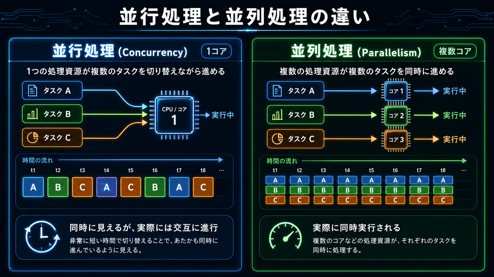

## 6 月 12 日

### 並行処理と並列処理

#### 並行処理

- 複数のタスクを「同時に進行しているように見せる」仕組み。
- タスクを細かく切り替えながら実行する。

##### 例

- javascript の非同期処理 async/await など

#### 並列処理

- 複数のタスクを「物理的に同時」に実行する仕組み。

##### 例

- マルチスレッド、マルチプロセス など
- javascript でも [Worker](https://developer.mozilla.org/ja/docs/Web/API/Worker) オブジェクトを使えば書けるらしい

#### 参考画像

**並行処理に向いている場面**

- I/O 待ち（ネットワーク通信、ファイル読み書き、DB クエリ）が多い処理

**並列処理に向いている場面**

- 計算量が多く CPU をフル活用したい処理（画像処理、機械学習、数値計算）
- I/O 待ちではなく純粋に計算がボトルネックになっている場合
