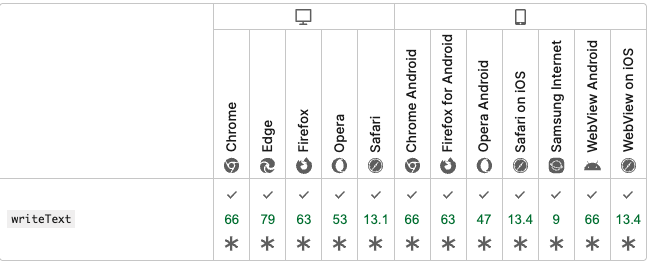

# LT会

## 7月14日

### uniqueness: true について

- `uniqueness: true` は、オブジェクトが保存される直前に属性の値が一意（unique）であることをチェックする。  
→ データベースに一意性を追加するわけではない。

- 異なる2つのデータベース接続が使われていると、一意であるべきカラムに同じ値を持つレコードが2つ作成される可能性がある。
- これを避けるには、データベース側でそのカラムに unique インデックスを作成する必要がある。


- 具体例
  - マイグレーションファイル:  
    `add_index :table_name, :column, unique: true`
  - MongoDBの場合:  
    `index({ email: 1 }, { name: 'email_unique', unique: true })`   
  
  だったりを追加する

- 参考  
  [Active Record バリデーション - uniqueness](https://railsguides.jp/active_record_validations.html#uniqueness)


## 7月17日

### namespace と resources の違い

- **namespace**
  - コントローラの名前空間を作成し、URLパスを整理するために使用される。

- **resources**
  - RESTfulなルーティングを提供し、リソースに対する標準的なアクションを定義する。
  - ネストした場合は、親リソースのIDをURLに含める。

#### 例1: namespace

```ruby
namespace :admin do
  resources :users
end
```

- 生成されるURL例
  - `GET /admin/users`
  - `POST /admin/users`
  - `GET /admin/users/:id`

#### 例2: resources のネスト

```ruby
resources :admin do
  resources :users
end
```

- 生成されるURL例
  - `GET /admin/:admin_id/users`
  - `POST /admin/:admin_id/users`
  - `GET /admin/:admin_id/users/:id`

#### `config/initializers/inflections.rb` で命名の規則を与えることができる


## 7月24日

### JavaScriptでのコピー機能の違い

- `document.execCommand("copy")`
  - 古いAPI。テキスト選択状態で実行するとクリップボードにコピーできる。
  - 非推奨、古いブラウザでもコピー可能。
  - 対応状況  
    


- `window.clipboardData`
  - 主にIEで使われていた。
  - 他のブラウザでは利用不可。

- `navigator.clipboard.writeText`
  - 新しい標準API。非同期でクリップボードにテキストを書き込める。
  - HTTPS環境でのみ利用可能。現在はほとんどのモダンブラウザでサポート。
  - 対応状況  
    


### 参考  
  [Document: execCommand() メソッド](https://developer.mozilla.org/ja/docs/Web/API/Document/execCommand)
  
  [Clipboard: writeText() method](https://developer.mozilla.org/en-US/docs/Web/API/Clipboard/writeText)

